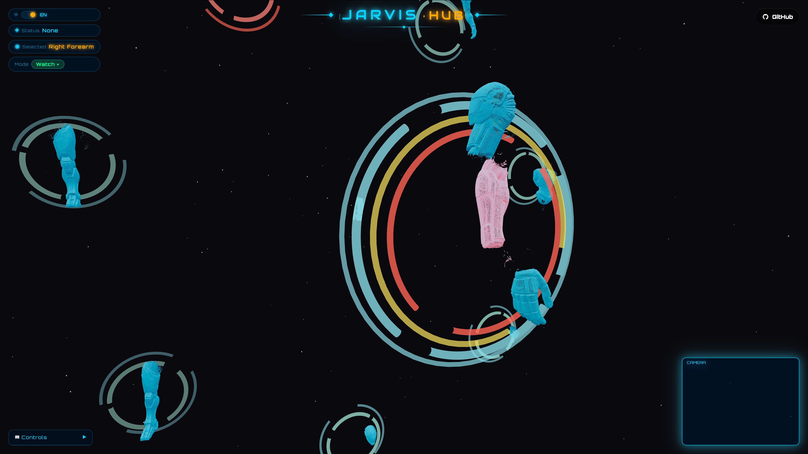

<h1 align="center">JARVIS Robot HUB - Mech Control System</h1>

<p align="center">
  Interactive 3D mech model display system — disassemble and inspect your mech at your fingertips
</p>

<p align="center">
  <a href="README.md">
    
  </a>
  <a href="README_EN.md">
    
  </a>
  
  
</p>
<p align="center">
  
</p>

## 🎮 Controls Guide

### Keyboard Controls

| Key | Function | Description |
|-----|----------|-------------|
| **A** | Disassemble | Hold to expand mech parts outward |
| **S** | Assemble | Hold to bring mech parts back together |
| **↑** | Switch Material | Cycle material mode upward (Default → Metal → Wireframe) |
| **↓** | Switch Material | Cycle material mode downward |
| **←** | Switch Component | In component view, switch to previous component |
| **→** | Switch Component | In component view, switch to next component |
| **Enter** | Confirm Selection | Confirm selection of highlighted part, enter component view |
| **ESC** | Back | Return to previous view (Component View → Full View) |

### Mouse Controls

| Action | Function | Description |
|--------|----------|-------------|
| **Hover** | Highlight Part | Hovering over a part highlights it |
| **Double-click** | Enter Component View | Double-click a major part to enter its detailed view |
| **Left-click Drag** | Rotate View | Hold left button and drag to rotate 3D view |
| **Scroll Wheel** | Zoom | Scroll to zoom in/out |
| **Right-click Drag** | Pan | Hold right button and drag to pan the view |

### Gesture Controls

> Please ensure camera access is allowed in the browser

**Left Hand: Switch Modes (number gestures)**
- ☝️ 1: Switch to “Watch Mode”
- ✌️ 2: Switch to “Zoom Mode”
- 🤟 3: Switch to “Explode Mode”
- 🖖 4: Switch to “Component Mode”

**Right Hand：Control**

**Watch Mode**
- ✋ Open palm + move: Rotate view

**Zoom Mode**
- ✋ Open palm: Zoom in
- ✊ Fist: Zoom out

**Explode Mode**
- ✋ Open palm: Disassemble
- ✊ Fist: Assemble
- 👆 Pointing: Click/select current cursor target

**Component Mode**
- ✋ Swipe up/down: Switch material
- ✋ Swipe left/right: Switch component

### ⚙️ Local Development

```bash
npm install
npm run dev
```

---

This project is open-sourced under the **MIT License**.

